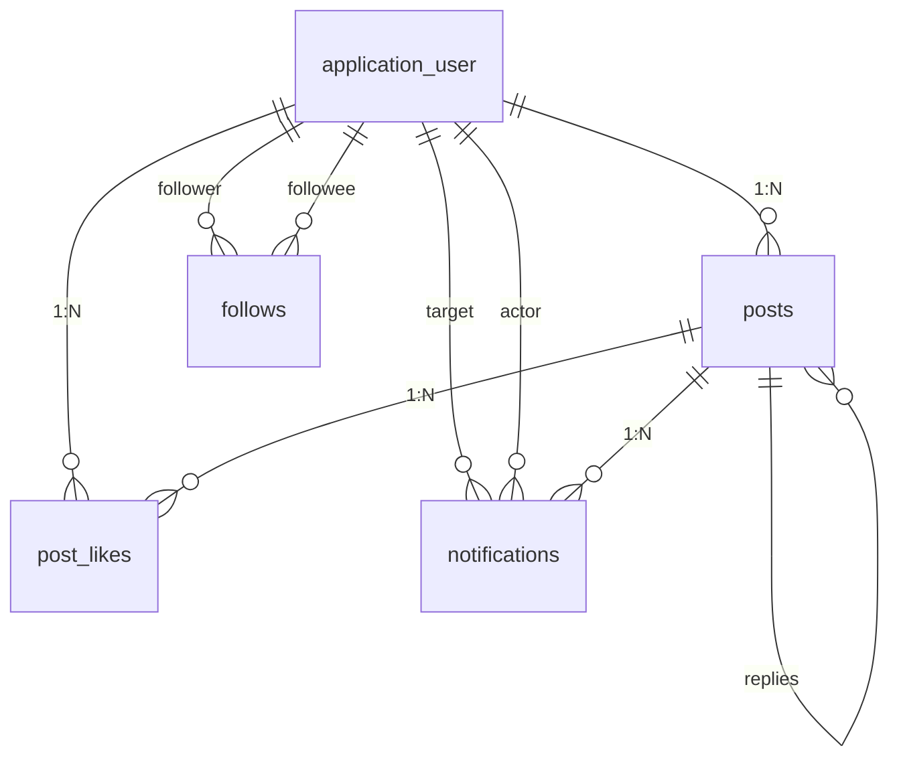
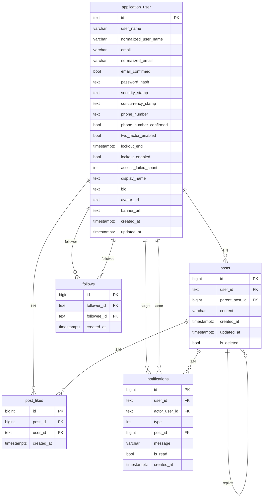

# データベース設計書

## 関係図

---

## ER 図

---

## テーブル項目

凡例:
- NN: 非NULL（NOT NULL）の列に ● を付与
- PK: 主キー列に ● を付与
- UK: 一意制約（Unique）を構成する列。複合一意のときは同じラベル（例: U1）を各列に付与。
- FK: 外部キー列に ● を付与（参照先は省略）

### application_user （ユーザー）

| 英語カラム名 | 日本語 | 型 (PostgreSQL) | NN | PK | UK | FK |
|--------------|--------|------------------|------|----|----|----|
| id | ユーザーID | text | ● | ● | | |
| user_name | ユーザー名 | character varying(256) |  |  |  |  |
| normalized_user_name | 正規化ユーザー名 | character varying(256) |  |  | U1 |  |
| email | メールアドレス | character varying(256) |  |  |  |  |
| normalized_email | 正規化メール | character varying(256) |  |  |  |  |
| email_confirmed | メール確認済 | boolean | ● |  |  |  |
| password_hash | パスワードハッシュ | text |  |  |  |  |
| security_stamp | セキュリティスタンプ | text |  |  |  |  |
| concurrency_stamp | 競合スタンプ | text |  |  |  |  |
| phone_number | 電話番号 | text |  |  |  |  |
| phone_number_confirmed | 電話番号確認済 | boolean | ● |  |  |  |
| two_factor_enabled | 二要素認証有効 | boolean | ● |  |  |  |
| lockout_end | ロックアウト終了 | timestamptz |  |  |  |  |
| lockout_enabled | ロックアウト有効 | boolean | ● |  |  |  |
| access_failed_count | 失敗回数 | integer | ● |  |  |  |
| display_name | 表示名 | text | ● |  |  |  |
| bio | 自己紹介 | text |  |  |  |  |
| avatar_url | アバターURL | text |  |  |  |  |
| banner_url | バナーURL | text |  |  |  |  |
| created_at | 作成日時 | timestamptz | ● |  |  |  |
| updated_at | 更新日時 | timestamptz | ● |  |  |  |

インデックス:
- UNIQUE INDEX (normalized_user_name)
- INDEX (normalized_email)
- INDEX (display_name)
- INDEX (created_at)

---

### posts（投稿）

| 英語カラム名 | 日本語 | 型 (PostgreSQL) | NN | PK | UK | FK |
|--------------|--------|------------------|------|----|----|----|
| id | 投稿ID | bigint | ● | ● |  |  |
| user_id | ユーザーID | text | ● |  |  | ● |
| content | 本文 | character varying(280) | ● |  |  |  |
| parent_post_id | 親投稿ID | bigint |  |  |  | ● |
| created_at | 作成日時 | timestamptz | ● |  |  |  |
| updated_at | 更新日時 | timestamptz | ● |  |  |  |
| is_deleted | 論理削除 | boolean | ● |  |  |  |

インデックス:
- INDEX (created_at)
- INDEX (user_id)
- INDEX (user_id, created_at)
- INDEX (parent_post_id)

---

### post_likes（投稿のいいね）

| 英語カラム名 | 日本語 | 型 (PostgreSQL) | NN | PK | UK | FK |
|--------------|--------|------------------|------|----|----|----|
| id | いいねID | bigint | ● | ● |  |  |
| post_id | 投稿ID | bigint | ● |  | U1 | ● |
| user_id | ユーザーID | text | ● |  | U1 | ● |
| created_at | 作成日時 | timestamptz | ● |  |  |  |

インデックス:
- UNIQUE INDEX (post_id, user_id)
- INDEX (post_id)
- INDEX (user_id)
- INDEX (user_id, created_at)

---

### follows（フォロー・フォロワー）

| 英語カラム名 | 日本語 | 型 (PostgreSQL) | NN | PK | UK | FK |
|--------------|--------|------------------|------|----|----|----|
| id | フォローID | bigint | ● | ● |  |  |
| follower_id | フォロワーID | text | ● |  | U1 | ● |
| followee_id | フォロー先ID | text | ● |  | U1 | ● |
| created_at | 作成日時 | timestamptz | ● |  |  |  |

インデックス:
- UNIQUE INDEX (follower_id, followee_id)
- INDEX (follower_id)
- INDEX (followee_id)

---

### notifications（通知）

| 英語カラム名 | 日本語 | 型 (PostgreSQL) | NN | PK | UK | FK |
|--------------|--------|------------------|------|----|----|----|
| id | 通知ID | bigint | ● | ● |  |  |
| user_id | 対象ユーザーID | text | ● |  |  | ● |
| actor_user_id | 行為者ユーザーID | text | ● |  |  | ● |
| type | 通知種別 | integer | ● |  |  |  |
| post_id | 関連投稿ID | bigint |  |  |  | ● |
| message | メッセージ | character varying(500) |  |  |  |  |
| is_read | 既読 | boolean | ● |  |  |  |
| created_at | 作成日時 | timestamptz | ● |  |  |  |

インデックス:
- INDEX (user_id)
- INDEX (actor_user_id)
- INDEX (post_id)
- INDEX (user_id, created_at)
- INDEX (user_id, is_read, created_at)

---

 
