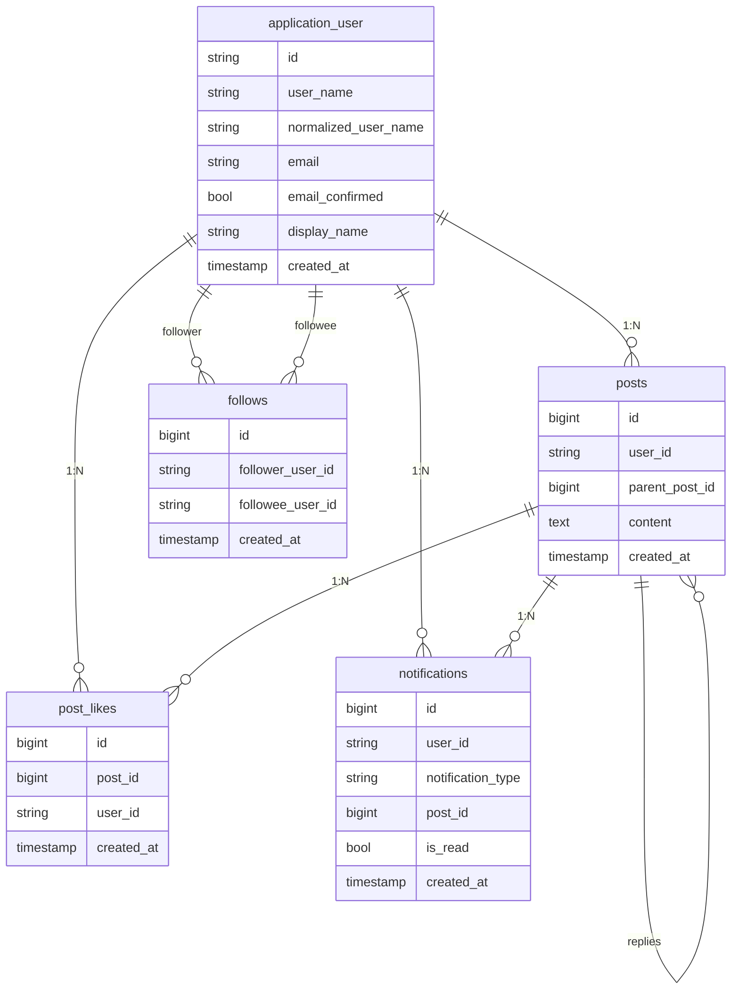

# ER 図 (概略)

```mermaid
erDiagram
    application_user ||--o{ posts : "1:N"
    application_user ||--o{ post_likes : "1:N"
    application_user ||--o{ follows : "follower"
    application_user ||--o{ follows : "followee"
    application_user ||--o{ notifications : "1:N"

    posts ||--o{ post_likes : "1:N"
    posts ||--o{ posts : "replies"
    posts ||--o{ notifications : "1:N"

    application_user {
        string id
        string user_name
        string normalized_user_name
        string email
        bool   email_confirmed
        string display_name
        timestamp created_at
    }

    posts {
        bigint id
        string user_id
        bigint parent_post_id
        text   content
        timestamp created_at
    }

    post_likes {
        bigint id
        bigint post_id
        string user_id
        timestamp created_at
    }

    follows {
        bigint id
        string follower_user_id
        string followee_user_id
        timestamp created_at
    }

    notifications {
        bigint id
        string user_id
        string notification_type
        bigint post_id
        bool   is_read
        timestamp created_at
    }
```